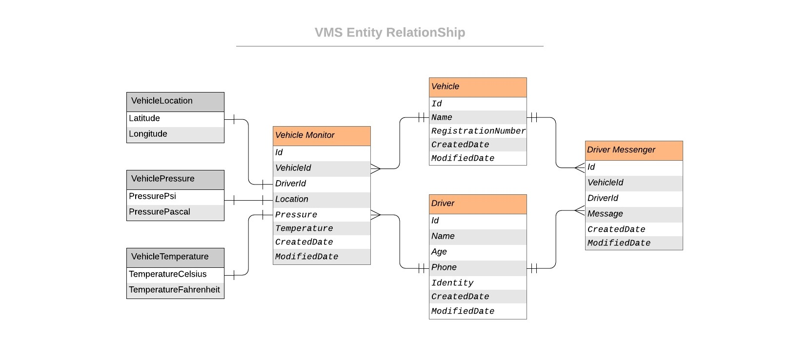
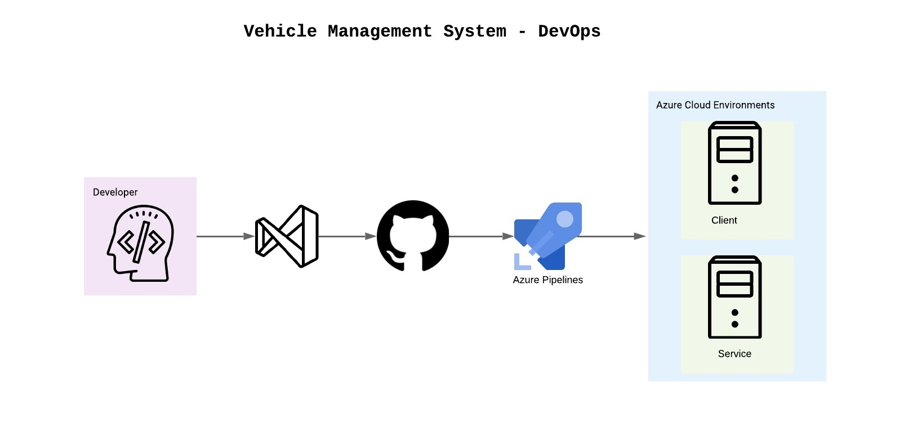

# Vehicle Management System

Vehicle Management System that allows the user to create, update and delete vehicles and it's tracking related entities from it.

[](https://dev.azure.com/iavivarma/VehicleManagementSystem/_build/latest?definitionId=3&branchName=master)
[](https://dev.azure.com/iavivarma/VehicleManagementSystem/_release?view=all&_a=releases&definitionId=2)
[](https://vehiclemanagementsystemapi.azurewebsites.net/)

---

## Entity Relationship



---

## DevOps Flow



---

## Environment Variables

> Need to configure environment variables in process or user or system level.

### Database Type Selection

* VEHICLEMANAGEMENT_CONNECTIONTYPE

```powershell
PS > [System.Environment]::GetEnvironmentVariable('VEHICLEMANAGEMENT_CONNECTIONTYPE')
```

> Set VEHICLEMANAGEMENT_CONNECTIONTYPE to 1, inorder to activate MongoDB type.

```powershell
PS > [System.Environment]::SetEnvironmentVariable('VEHICLEMANAGEMENT_CONNECTIONTYPE', 1)
```

### MongoDB Connection Variables

* MONGODB_USERNAME
* MONGODB_CONNECTIONURL (E.g: vms-avi.azure.mongodb.net/test)
* MONGODB_ACCESSKEY

#### Get MongoDB Connection Variables

```powershell
PS > [System.Environment]::GetEnvironmentVariable('MONGODB_USERNAME')
PS > [System.Environment]::GetEnvironmentVariable('MONGODB_CONNECTIONURL')
PS > [System.Environment]::GetEnvironmentVariable('MONGODB_ACCESSKEY')
```

#### Set MongoDB Connection Variables

```powershell
PS > [System.Environment]::SetEnvironmentVariable('MONGODB_USERNAME', 'MongoDBUserName')
PS > [System.Environment]::SetEnvironmentVariable('MONGODB_CONNECTIONURL', 'vms-avi.azure.mongodb.net/test')
PS > [System.Environment]::SetEnvironmentVariable('MONGODB_ACCESSKEY', 'MongoDBPassword')
```

---

## Postman

### Documentation

* [Postman Documenter](https://documenter.getpostman.com/view/1806674/SzezdXbv)

### Collection

* [](https://app.getpostman.com/run-collection/d211da1cc40ce4fb6540)

---

## Things to improve

### Client Side

- [ ] Login and SingUp Page 
- [ ] Add roles like Admin, Manager, Driver 
- [ ] Add Pagination, Sorting and Filter
- [ ] More responsive UI
- [ ] UI Testing
- [ ] Code Security and analysis

### Server Side

- [ ] Token based authentication
- [ ] User Entity
- [ ] Moq Tests
- [ ] Data Driven Tests
- [ ] Code Security and analysis

---

## Why Web API and React.

* Web APIs provides a flexible way to communicate with context-based applications that can interact with the physical world, instead only through the UI.
    * Vehicle Management System is expected to get the data from various devices which would be docked in different locations like Vehicle, Freezer, etcetera. Web API would be a right choice to consider for one of the reason and it supports wide range of IOT devices.
* React is one of the modern JavaScript frameworks which allows developer to create large scale web application that can exchange the data. React provides better performance compared to other JavaScript frameworks.

---

## Technical Stack

### Client

 Tools & Technologies | --  |
--- | --- |
Front End | ReactJS |
Programming Language | JavaScript |
Responsive UI Framework | Material, Bootstrap |
Data Exchange | json |
Server | NodeJs |
DevOps | Azure DevOps |
Cloud | Azure App Service, Firebase |
Source Control | GitHub |
Other Web | HTML, CSS |

### Server

 Tools & Technologies |  |
--- | --- |
Programming Language | C# |
Data Exchange | json |
Database | MongoDB (Configurable to other DB) |
Server | ASP NET WebAPI |
DevOps | Azure DevOps |
Cloud | Azure App Service |
API Testing | PostMan |
Source Control | GitHub |
